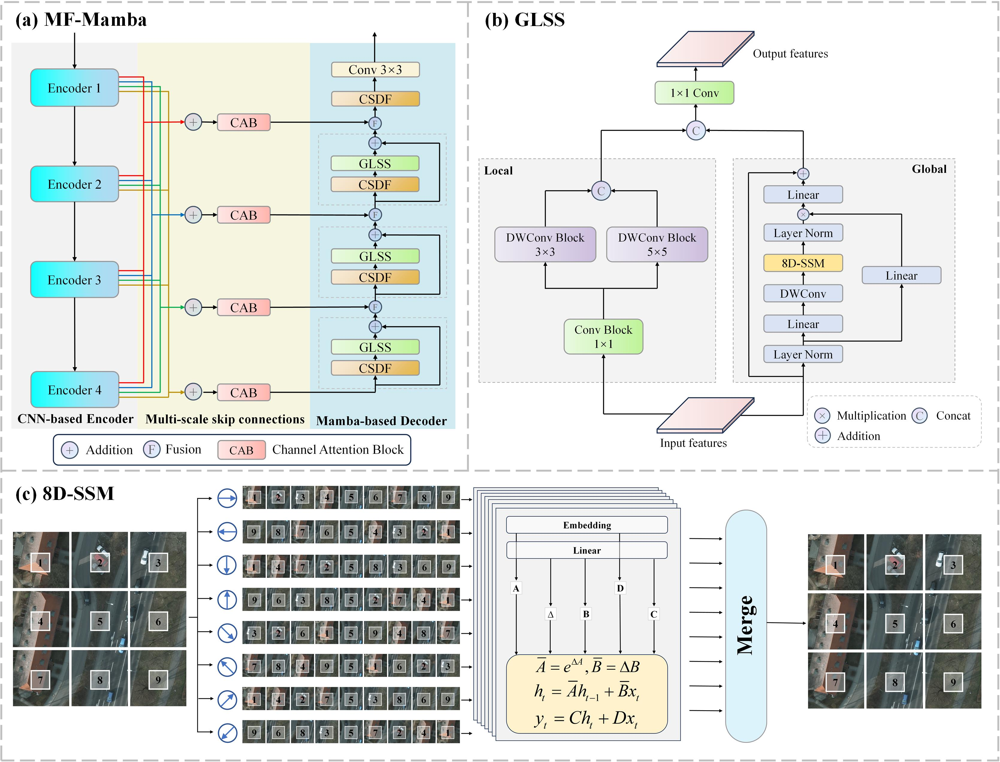

# MF-Mamba: Multiscale Convolution and Mamba Fusion Model for Semantic Segmentation of Remote Sensing Imagery

This is an official implementation of MF-Mamba in our TGRS 2025 paper "MF-Mamba: Multiscale Convolution and Mamba Fusion Model for Semantic Segmentation of Remote Sensing Imagery".

## Main Environments
```
conda create -n MFMamba python=3.8
conda activate MFMamba
pip install torch==2.1.2 torchvision==0.16.2 torchaudio==2.1.2 --index-url https://download.pytorch.org/whl/cu121
pip install causal_conv1d==1.0.0
pip install mamba_ssm==1.0.1 
```
If problems occur during installation, the corresponding precompiled package can be downloaded and used for installation. Refer to [causal-conv1d](https://github.com/Dao-AILab/causal-conv1d/releases) and [mamba-ssm](https://github.com/state-spaces/mamba/releases).

## Pretrained weights
We use the ImageNet pretrained HRNet-W18-C model 'hrnetv2_w18_imagenet_pretrained.pth' from [HRNets](https://github.com/HRNet/HRNet-Image-Classification?tab=readme-ov-file).

## Citation
If you find it useful, please consider citing:
```
@ARTICLE{11098811,
  author={Xiao, Pu and Dong, Yuting and Zhao, Ji and Peng, Tieqi and Geiß, Christian and Zhong, Yanfei and Taubenböck, Hannes},
  journal={IEEE Transactions on Geoscience and Remote Sensing}, 
  title={MF-Mamba: Multiscale Convolution and Mamba Fusion Model for Semantic Segmentation of Remote Sensing Imagery}, 
  year={2025},
}

```